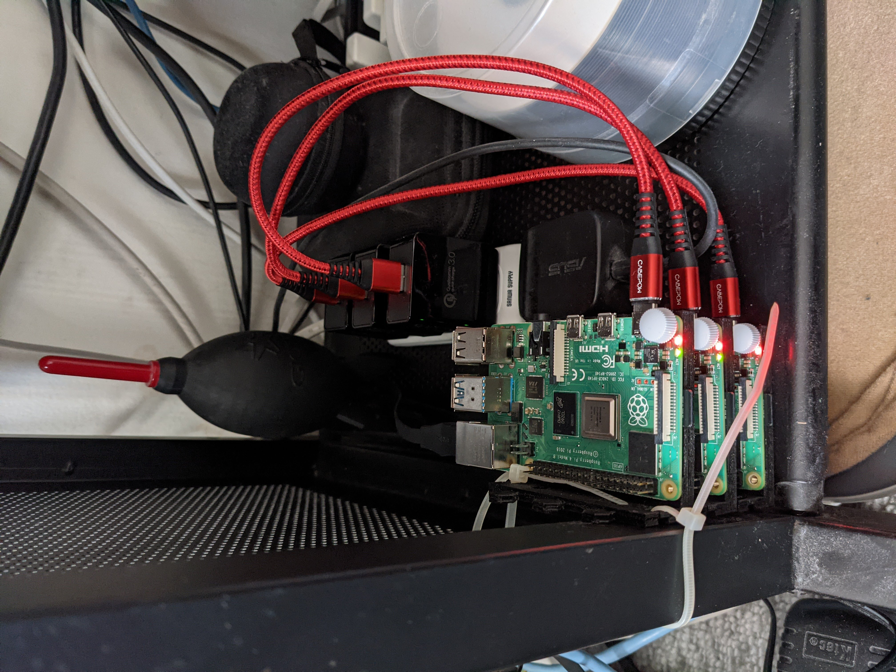
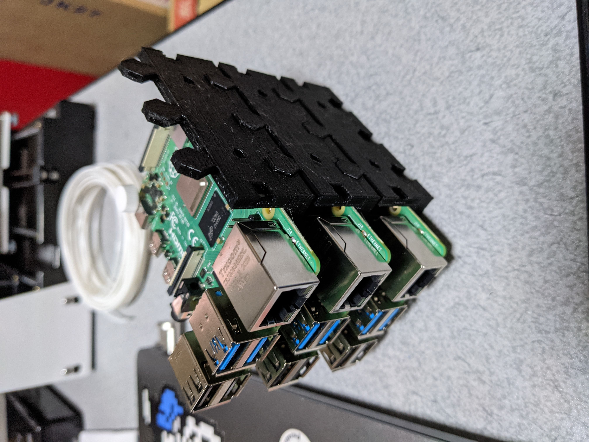

# Raspberry Pi 4 Model B (8GB RAM) Raspbian 64bit 3台で始めるおうちk8sクラスター



# 作業環境
PC: MacOS catalina(10.15.7)  
Raspberry Pi: Model B (8GB RAM)  
Raspberry Pi OS: Raspbian 64bit

# 組み立て
参考サイト: https://qiita.com/reireias/items/0d87de18f43f27a8ed9b

僕は5V 3Aの電源を用意しましたが、USBポートに何か差さない限りはよく売ってる5V 2.4AのUSBハブで問題ないかも

クラスターの土台は https://www.thingiverse.com/thing:1667303 のデータを3Dプリンタで印刷  
3DプリンタがEasyThreed X1のため、10x10cmに収まるサイズの土台にしました



# Raspbian 64bitをSDカードに書き込む
参考サイト: https://www.itmedia.co.jp/news/articles/2012/28/news030.html

## Raspberry Pi ImagerをPCにインストール
https://www.raspberrypi.org/software/

## 最新のイメージをダウンロード＆インストール
http://ftp.jaist.ac.jp/pub/raspberrypi/raspios_lite_arm64/images/  
(2021/2/21時点では2020-08-20-raspios-buster-arm64-lite.zipが最新)

## SDカードに書き込む
- Raspberry Pi Imagerを起動する
- PCにMicroSDカードを挿入し、SD Cardで選択
- Operating System > Use Customでダウンロードしたイメージを選択
- WRITE

SDカードへの書き込みを3台分繰り返す

# 初期設定
基本的にはsuで行うコマンドばっかりなので、sudoを前に付けるかsudo su -でrootユーザになってから作業しましょう

## ログイン
pi:raspberry でログインする 最初からsudo権限アリ

## ファームウェアの更新(必要無いかも…自己責任でやりましょう)
[Raspberry Pi]
```sh
rpi-update
```

## sshを有効にする
[Raspberry Pi]
```sh
# コマンド入力後、5. Interfacing Options > P2 SSHをenabledにする
raspi-config
```

## sshログイン用ユーザ作成
*${}の部分は任意の名前に置き換えること*

[Raspberry Pi]
```sh
groupadd -g 1010 ${グループ名}
useradd -s /bin/bash -g ${グループ名} -m ${ユーザ名}
cd ~
vi chpasswd.txt
```

chpasswd.txt
```sh
${ユーザ名}:${パスワード}
```

[Raspberry Pi]
```sh
chpasswd < chpasswd.txt
rm chpasswd.txt
```

## ssh鍵作成
PC、Raspberry Piのいずれかで作業(僕はMacだったのでPCで作業し、scpでRaspberry Piにコピーしました)

[PC or Raspberry Pi]
```sh
# ファイル保存場所、名前は任意に
ssh-keygen -t rsa
```
id_rsa(秘密鍵)はPCに配置し、sshログイン時に使う

### id_rsa.pub(公開鍵)をRaspberry Piに配置する
[Raspberry Pi]
```sh
cd ~
mkdir .ssh # .sshフォルダ無ければ作る
chmod 700 .ssh
mv id_rsa.pub authorized_keys # id_rsa.pubをauthorized_keysにリネーム
chmod 600 authorized_keys
mv authorized_keys .ssh
```

## sshdの設定変更
[Raspberry Pi]
```sh
vi /etc/ssh/sshd_config
```
sshd_config
```sh
# 以下に該当する行を書き換え
# Port 22
Port 2222

# PasswordAuthentication yes
PasswordAuthentication no
```

[Raspberry Pi]
```sh
service sshd restart
```

## パッケージ更新
[Raspberry Pi]
```sh
apt update
apt upgrade
```

## host名の変更
[Raspberry Pi]
```sh
hostnamectl set-hostname ${ホスト名}
vi /etc/hosts # raspberrypiを${ホスト名}に置き換える
```

3台のホスト名はそれぞれ以下のようにしました
- k8s-master
- k8s-worker0
- k8s-worker1

## swapの無効化
swapが有効だとkubeadmが動かないので無効にする

[Raspberry Pi]
```sh
dphys-swapfile swapoff
systemctl stop dphys-swapfile
systemctl disable dphys-swapfile
```

## cgroupsのmemory有効化
参考サイト:https://kuromt.hatenablog.com/entry/2019/01/03/233347

有効にしないとkubeadm init時にCGROUPS_MEMORY missingになる

[Raspberry Pi]
```sh
vi /boot/cmdline.txt
```

cmdline.txt
```sh
# 末尾に cgroup_enable=cpuset cgroup_memory=1 cgroup_enable=memory を追記する
console=serial0,115200 console=tty1 root=PARTUUID=XXXXXXXX-XX rootfstype=ext4 elevator=deadline fsck.repair=yes rootwait cgroup_enable=cpuset cgroup_memory=1 cgroup_enable=memory
```

cmdline.txt書き換え後、Raspberry Piを再起動

初期設定を3台分繰り返す

# Docker、k8sのインストール
参考サイト: https://blog.nownabe.com/2020/07/19/home-kubernetes-2/

CRIはCRI-Oで行きたかったけど依存関係のバージョン相違で入らなかった(多分どこかのaptのリポジトリ追加すればいける)ので手っ取り早くDockerにしました

## ネットワーク設定
[Raspberry Pi]
```sh
modprobe br_netfilter
modprobe overlay
cat <<EOF > /etc/sysctl.d/k8s.conf
net.bridge.bridge-nf-call-ip6tables = 1
net.bridge.bridge-nf-call-iptables = 1
net.ipv4.ip_forward = 1
EOF
sysctl --system
```

## Dockerインストール
[Raspberry Pi]
```sh
apt remove docker docker-engine docker.io runc
apt-get install \
    apt-transport-https \
    ca-certificates \
    curl \
    gnupg-agent \
    software-properties-common
curl -fsSL https://download.docker.com/linux/debian/gpg | apt-key add -
add-apt-repository \
   "deb [arch=arm64] https://download.docker.com/linux/debian \
   $(lsb_release -cs) \
   stable"
apt update
apt install docker-ce docker-ce-cli containerd.io

# Dockerデーモンの設定
cat > /etc/docker/daemon.json <<EOF
{
  "exec-opts": ["native.cgroupdriver=systemd"],
  "log-driver": "json-file",
  "log-opts": {
    "max-size": "100m"
  },
  "storage-driver": "overlay2"
}
EOF

mkdir -p /etc/systemd/system/docker.service.d
systemctl daemon-reload
systemctl restart docker
```

## kubeadm、kubelet、kubectlのインストール
```sh
curl -s https://packages.cloud.google.com/apt/doc/apt-key.gpg | apt-key add -
echo 'deb https://apt.kubernetes.io/ kubernetes-xenial main' > /etc/apt/sources.list.d/kubernetes.list
apt update
apt install -y kubeadm kubelet kubectl
apt-mark hold kubelet kubeadm kubectl # バージョン固定化
```

Docker、k8sの設定を3台分繰り返す

# マスターノードでControl Plane初期化
以降はマスターノードのみの作業

[Raspberry Pi Master]
```sh
kubeadm init \
  --dry-run \
  --control-plane-endpoint=${マスターノードマシンのアドレス} \
  --pod-network-cidr=10.4.0.0/14 \
  --service-cidr=10.2.0.0/15 \
  --service-dns-domain "${サービスのドメイン名}"
```

成功時の出力の末尾 kubeadm join ... の内容をどこかに控えておく  
ワーカーノードからマスターノードに接続する際のコマンドになります

## PCで動作確認
マスターノードの/etc/kubernetes/admin.confをPCにコピーする

PCにkubectlが入ってない場合は、Docker DesktopをインストールしKubernetesを有効化するなどでkubectlコマンドを使える状態にしてください  
参考サイト: https://noumenon-th.net/programming/2019/04/11/kubernetes01/

[PC]
```sh
# コンテキスト一覧取得 kubernetes-admin@kubernetesがあるか確認
KUBECONFIG=~/.kube/config:~/.kube/admin.conf kubectl config get-contexts
# コンテキストをkubernetes-admin@kubernetesに切り替える
KUBECONFIG=~/.kube/config:~/.kube/admin.conf kubectl config use-context kubernetes-admin@kubernetes
# 一覧表示
KUBECONFIG=~/.kube/config:~/.kube/admin.conf kubectl get all -A
```

一覧表示でpodやサービスがひとまず確認できればOK (この時点ではまだcorednsはSTATUS:Pendingのまま進まない)
```
NAMESPACE        NAME                                     READY   STATUS    RESTARTS   AGE
kube-system      pod/coredns-74ff55c5b-w2hv5              1/1     Running   0          158m
kube-system      pod/coredns-74ff55c5b-zfbfk              1/1     Running   0          158m
kube-system      pod/etcd-k8s-master                      1/1     Running   0          158m
kube-system      pod/kube-apiserver-k8s-master            1/1     Running   0          158m
kube-system      pod/kube-controller-manager-k8s-master   1/1     Running   0          158m
kube-system      pod/kube-proxy-8654j                     1/1     Running   0          150m
kube-system      pod/kube-proxy-cjccz                     1/1     Running   0          141m
kube-system      pod/kube-proxy-tt9bg                     1/1     Running   0          158m
kube-system      pod/kube-scheduler-k8s-master            1/1     Running   0          158m
```

以降は必要に応じてKUBECONFIGを環境変数に設定してください

[PC]
```sh
export KUBECONFIG=~/.kube/config:~/.kube/admin.conf
```

# ワーカーノードをマスターノードに繋ぐ
以降はワーカーノードのみの作業

マスターノードのkubeadm initコマンドで控えておいたkubeadm joinコマンドを実行する  

[Raspberry Pi Worker]
```sh
kubeadm reset
# 以下は控えておいたkubeadm joinコマンドに置き換える
kubeadm join ${マスターノードのIPアドレス}:6443 --token XXX  --discovery-token-ca-cert-hash sha256:XXX
```

ワーカーノード2台で繰り返す

kubeadm joinコマンド忘れた場合はマスターノードで以下コマンド実行

[Raspberry Pi Master]
```sh
kubeadm token create --print-join-command
```

## 動作確認
[PC]
```sh
# ノード一覧表示
kubectl get nodes
```

一覧表示でワーカーノードが登録されてたらOK
```
NAME          STATUS   ROLES                  AGE     VERSION
k8s-master    Ready    control-plane,master   4h14m   v1.20.4
k8s-worker0   Ready    <none>                 4h6m    v1.20.4
k8s-worker1   Ready    <none>                 3h57m   v1.20.4
```

# corednsを動かすためにflannelを導入
corednsがPendingのまま動かないので、flannelを導入する

[PC]
```sh
curl -O https://raw.githubusercontent.com/coreos/flannel/master/Documentation/kube-flannel.yml
kubectl apply -f kube-flannel.yml
```

# ServiceType:LoadBalancerを使うためにmetallbを導入
参考サイト: https://qiita.com/tmatsu/items/f45f0ca07b4f8489df85

LoadBalancerのserviceを起動してもexternalIPがPendingのままなので、metallbを導入する

metallb-namespace.yaml
```yaml
kind: Namespace
apiVersion: v1
metadata:
  name: metallb-system
  labels:
    name: metallb-system
```

[PC]
```sh
kubectl apply -f metallb-namespace.yaml
# ${バージョン}はmetallbのgithubを確認し、最新のReleaseバージョンに置き換える
kubectl apply -f https://raw.githubusercontent.com/google/metallb/v${バージョン}/manifests/metallb.yaml
```

動作モードにBGPモード、L2モードがあるが、今回はL2モードで動作させる

l2.yaml
```yaml
apiVersion: v1
kind: ConfigMap
metadata:
  namespace: metallb-system
  name: config
data:
  config: |
    address-pools:
    - name: my-ip-space
      protocol: layer2
      addresses:
      # LoadBalancerのExternalIP割り振り範囲CIDR(192.168.1.192-192.168.1.255)
      - 192.168.1.192/26
```

[PC]
```sh
kubectl apply -f l2.yaml
# metallb用のsecret作成
kubectl create secret generic -n metallb-system memberlist --from-literal=secretkey="$(openssl rand -base64 128)"
```

## 動作確認
参考サイト: https://qiita.com/joe_hirata/items/0c4073f2cc39027d1c32

とりあえずnginxイメージでテストを行うべし

# プライベートコンテナリポジトリの作成
現状はDockerHubにコンテナイメージ上げる必要がある  
プライベートコンテナリポジトリの作成は作業中…

# その他
## Raspberry PiのCPU温度、電圧など確認
参考サイト: https://qiita.com/kouhe1/items/5f3f0e6fdb55e7164deb
